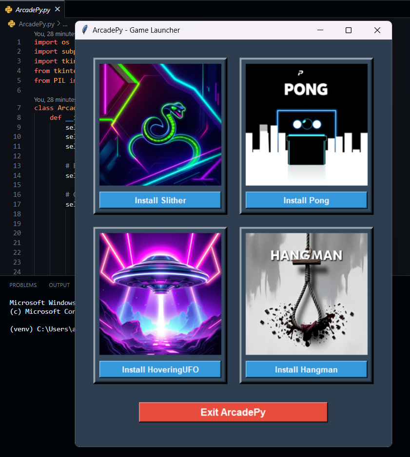

<div align="center">  </div>

# ArcadePy

ArcadePy is an umbrella project that merges four classic Python-based arcade games into one repository. With a simple user interface, the `arcadepy.py` file allows you to choose from four exciting games: Slither, Pong, Hovering UFO, and Hangman. Each game offers unique mechanics and is built using Python, providing an entertaining and engaging experience right in your terminal or command line interface.

---

## Features

- **Slither**: A classic snake game where you control a snake to eat food and grow longer while avoiding hitting the walls or itself.
- **Pong**: The iconic pong game where you compete against a computer-controlled paddle to score points.
- **Hovering UFO**: A game where you control a UFO and need to hover through obstacles while avoiding collisions.
- **Hangman**: A word guessing game where you have to guess a hidden word by suggesting letters.

## Requirements

To run the games, make sure you have Python 3.x installed. You can download it from the official [Python website](https://www.python.org/downloads/).

Additionally, some games might require external libraries, which can be installed using the following:

```bash
pip install -r requirements.txt
```

## How to Play

- **Clone the repository**:

```bash
git clone https://github.com/AaryanGole26/ArcadePy.git
```

- **Navigate to the project folder**:

```bash
cd ArcadePy
```

- **Run the main game launcher (arcadepy.py)**:

```bash
python ArcadePy.py
```

**You will be presented with a menu of four options, each representing one of the games. Click the corresponding button to start a game.**

## Contributing
*Feel free to fork this repository, make improvements, or add new games! Contributions are welcome. Please follow these steps for contributing:*

  1. Fork the repository.
  2. Create a new branch (git checkout -b feature-name).
  3. Commit your changes (git commit -am 'Add feature').
  4. Push to the branch (git push origin feature-name).
  5. Create a new pull request.

---

## Tutorial 

- You can watch a demo of the game in action by following this link:

[](https://player.vimeo.com/video/1034330514?autoplay=1&muted=1)

- Here’s a sample output of the game interface:

<div align="center">  </div>

---

## License

*This project is open source and available under the MIT License.*
